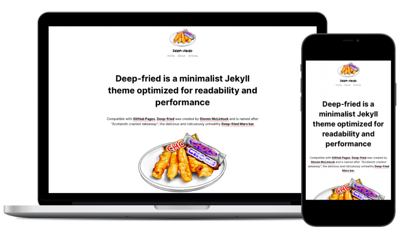

# Deep-fried Jekyll Theme

Deep-fried is a minimalist Jekyll theme optimized for readability and performance.



Compatible with [GitHub Pages](https://pages.github.com), [Deep-fried](https://github.com/kiltandcode/deep-fried-jekyll-theme) was created by [Steven McLintock](http://www.kiltandcode.com) and is named after *"Scotland’s craziest takeaway"*, the delicious and ridiculously unhealthy [Deep-fried Mars bar](https://en.wikipedia.org/wiki/Deep-fried_Mars_bar).

## How to Use the Deep-fried Jekyll Theme

To use the Deep-fried Jekyll theme, simply fork the [GitHub](https://github.com) 
repository located at [github.com/kiltandcode/deep-fried-jekyll-theme](https://github.com/kiltandcode/deep-fried-jekyll-theme) 
and start modifying the **_config.yml** file. That's it!

If you would like to run the theme locally, please use the commands:

**To initially install the required gems:**

```terminal
bundle install
```

**Once the required gems are installed, run the website:**

```terminal
bundle exec jekyll serve
```

## Related Posts

The Deep-fried Jekyll theme includes the ability to display related posts at the 
bottom of each article. This can be enabled in the **_config.yml** file and will use the 
**tags** metadata property located in the front matter of the post.

For example, using the following in the front matter will display related posts with 
the tag **"deep-fried"**:

```yaml
tags: deep-fried
```

## Stylesheets

The Deep-fried Jekyll theme has a couple of built-in stylesheets that are referenced 
in the **_config.yml** file, and you can add as many additional stylesheets as you would 
like by appending to the following section:

```yaml
# Stylesheets
stylesheets:
  - '/css/stylesheet.css'
  - '/css/syntax.css'
```

## Icons

The Deep-fried Jekyll theme has the ability to add an icon at the top of each post. 
The icon can be referenced as a metadata property in the front matter of the post as 
follows: 

```yaml
icon: deep-fried
```

In the **_data** directory of the Deep-fried Jekyll theme, there is the file **icons.yml** 
that will store all of the icons and their locations:

```yaml
deep-fried:
  src: /assets/img/icons/deep-fried.png
```

## Authors

Similar to icons, you can assign an author to each post. The author can be referenced as 
a metadata property in the front matter of the post as follows:

```yaml
author: steven
```

In the **_data** directory of the Deep-fried Jekyll theme, there is the file **authors.yml** 
that will store all of the authors and their names:

```yaml
steven:
  name: 'Steven McLintock'
```

## Includes

If you would like to use images in your posts, you can use the **image.html** include. 
***Please note:*** the images should be located in the directory structure: 
**assets/img/*[YEAR]*/*[MONTH]*/image.png**

```yaml

```

If you would like to embed videos in your posts, you can use the **embed-video.html** include:

```yaml

```
